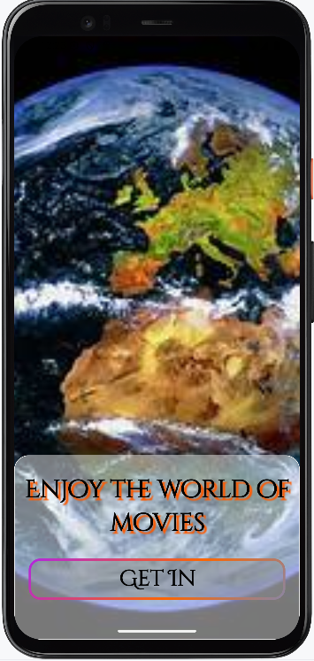
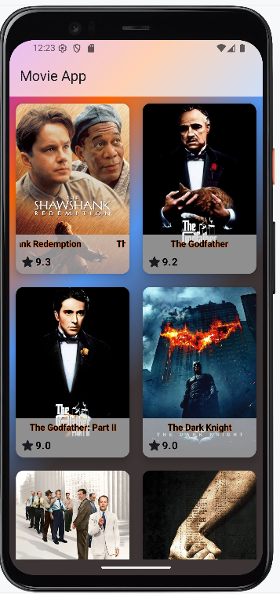
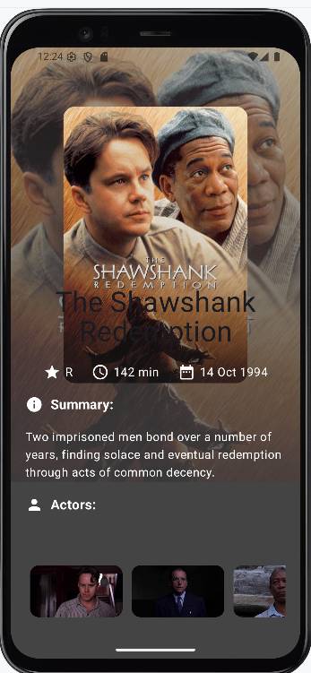

App Name: MovieApp

# 🎬 Jetpack Compose Movie Browser App

An Android application built with **Jetpack Compose** that fetches movie data using the [MoviesAPI.ir](https://moviesapi.ir/api/v1/) and displays a list of movies with details like **poster, summary, and actors**. The app uses **Jetpack Navigation** for smooth transitions between screens.

---

## 📱 Features

- 🎥 Display list of movies from API
- 📖 Movie details: poster, plot summary, rating
- 🎭 Actor list for each movie
- ⚙️ Jetpack Compose UI
- 🔁 Seamless screen navigation with Jetpack Navigation
- 🌐 API integration using Retrofit
- 📦 Clean MVVM architecture with modular components

---

## 🔧 Technologies Used

- **Kotlin**
- **Jetpack Compose**
- **Jetpack Navigation**
- **Retrofit + Gson**
- **Coroutines / ViewModel / LiveData**

---

## 🔗 API Used

- [🎞️ MoviesAPI.ir](https://moviesapi.ir/api/v1/)
    - Free API to fetch movies, actors, posters, summaries, and more.

> 📝 Note: No actual movie download functionality is implemented — the app is designed as a conceptual movie browser.

---

## 📸 Screenshots

<div align="center">
  
  
  
</div>

---

## 🚀 Getting Started

1. Clone the repo:
   ```bash
   git clone https://github.com/PremmChand/MovieApp.git

👤 Author
Premm Chand

🔗 [GitHub](https://github.com/PremmChand)

